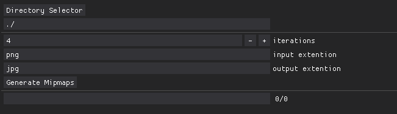

# Thumbnail Generator

This tool allows you to create thumbnails / mipmaps for any use.

- You need to first select the directory.
- Iterations is the amount of division/images the program will produce.
    - Example :  3 iterations for a 2048x2048 image will produce :
        - 1024x1024 / 512x512 / 256x256
  
  the minimum size for the images is 16 (can be changed in the code)

- input extention file type to process, do not put a "." before the extention name
- output extention file type of the processed image, do not put a "." before the extention name
- pressing generate mipmaps will crawl through the folder and process every images matching the input extention

> Output image name will be "imageName_widthxheight.outputExtention".There is a regex to prevent reclusive image processing. Thus your base image shouldn't be named "something_SomeValuexSomeValue.something"

> Moreover if you update your images and reduce the iterations values, smaller images wont be updated

> This program only create and update the necessary files

> All images formats supported by [Pillow](https://pillow.readthedocs.io/en/stable/handbook/image-file-formats.html) should  be working, however only jpeg and png have been tested